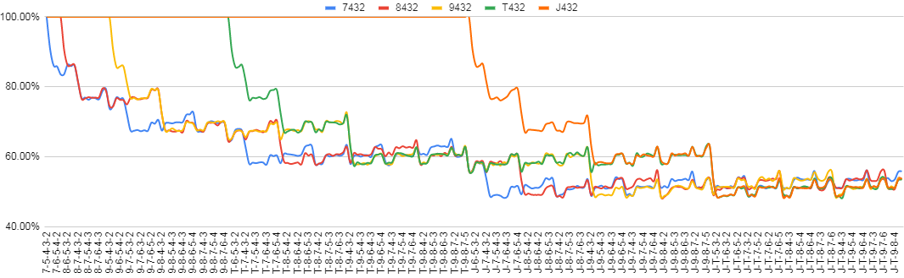

# 273: Deuce to Seven Triple Draw
A variant of poker which the normal hand rankings are inverted. Exploring strategy, statistics, and game theory through simulation.

## Deliverables
Simulation-based results that explore the odds of drawing to certain hands based on how many rounds are left and how many opponents are available.

### Single Draw to smooth 7, 8, 9, T, J

This chart shows the odds of not losing (wins + draws) when you have a hand (horizontal axis) and your opponent is taking a single draw with one of the following hands: 7432, 8432, 9432, T432, J432.

For instance, you can find when you are holding `T-8-6-4-2`, you won't lose 60% of the time against `7-4-3-2` drawing 1. Let's calculate the odds in a single-draw situation compared with our simulated results.

With 9 cards shown, there are 43 remaining.
<table>
    <tr><td>Hand</td><td>Outs</td><td>Odds</td><td>Simulation</td><td>Difference</td></tr>
    <tr><td>7-4-3-2</td><td>
        <table>
            <tr><td>5-5-5-5</td><td>6-6-6</td></tr>
            <tr><td>8-8-8</td><td>9-9-9-9</td></tr>
            <tr><td>T-T-T</td><td>&nbsp;</td></tr>
        </table>
    </td><td>1 - <b>17</b>/43 = <b>60.47%</b></td><td><b>60.23%</b></td><td>0.24%</td></tr>
    <tr><td>8-4-3-2</td><td>
        <table>
            <tr><td>5-5-5-5</td><td>6-6-6</td></tr>
            <tr><td>7-7-7-7</td><td>9-9-9-9</td></tr>
            <tr><td>T-T-T</td><td>&nbsp;</td></tr>
        </table>
    </td><td>1 - <b>18</b>/43 = <b>58.14%</b></td><td><b>58.32%</b></td><td>0.18%</td></tr>
</table>

With 43 cards remaining, it makes sense how each out represents `2.33%` equity. This will become more valuable later when multiple rounds of drawing allow us to gain additional information.

## Deuce to Seven, Triple Draw Rules
### Hand Rankings

### Structure

